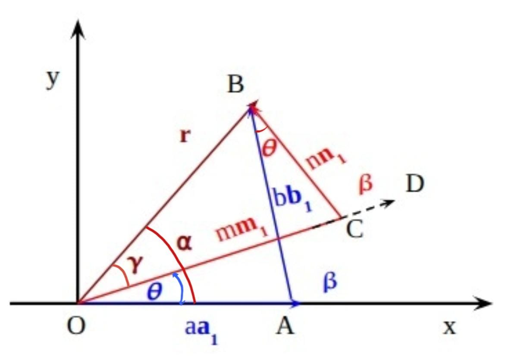

# Angle Calculation Process

When two single layers of a 2D material are stacked with a small misalignment, they produce a moiré pattern with a length scale much larger than the periodicity of either individual layer. At specific twist angles, this results in a ***commensurate moiré pattern***—a structure where atoms from one layer align exactly with those of the other.

In this section, we describe how **MoirePy** calculates the ***commensurate rotation angles*** between two lattices confined to a bounded region. The goal is to identify angles where the lattices align periodically, producing well-ordered moiré patterns that are physically observable.

## Problem Statement

Let lattices $A$ and $B$ be two periodic point sets in two dimensions, each defined by their respective lattice vectors.

We address the following geometric question:

**Given** a rotation angle $\theta$, **does there exist** a point $\mathbf{p} \in A$ and a point $\mathbf{q} \in B$ such that

$$
\mathbf{p} = R(\theta)\mathbf{q}
$$

where $R(\theta)$ denotes the standard two-dimensional rotation matrix:

$$
R(\theta) =
\begin{bmatrix}
\cos\theta & -\sin\theta \\
\sin\theta & \cos\theta
\end{bmatrix}
$$

To bound the computation, we restrict our analysis to a finite region by considering only lattice points within a circular region of radius $r$. Let the truncated sets be $A_r = A \cap \text{circle}(r)$ and $B_r = B \cap \text{circle}(r)$.

Our goal is to determine the set of angles $\theta$ for which there exists a pair of points $\mathbf{p} \in A_r$ and $\mathbf{q} \in B_r$ satisfying:

$$
\mathbf{p} = R(\theta)\mathbf{q}
$$

These angles correspond to commensurate alignments between the two lattices, yielding physically observable moiré patterns.

## Traditional Diophantine Equation Approach

In commensurate moiré superlattices, specific periodic points exist where atoms from the top and bottom layers align exactly. To analyze these alignments, let $\vec{a}_1$, $\vec{b}_1$ and $\vec{m}_1$, $\vec{n}_1$ denote the primitive lattice vectors of the lower and upper layers, respectively. The atomic positions in each layer are given by:

$$
\vec{R}^1_{p,q} = a\vec{a}_1 + b\vec{b}_1 \quad \text{and} \quad
\vec{R}^2_{m,n} = R(\theta)(m\vec{m}_1 + n\vec{n}_1), \quad a, b, m, n \in \mathbb{Z}
$$

For a commensurate moiré superlattice to form, there must exist integers $a, b, m, n$ such that:

$$
|a\vec{a}_1 + b\vec{b}_1| = |m\vec{m}_1 + n\vec{n}_1|
$$

This leads to a condition based on vector magnitudes and orientations:

$$
\vec{a}_1 \cdot \vec{b}_1 = \vec{m}_1 \cdot \vec{n}_1 = \cos{\beta} = \frac{m^2 + n^2 - a^2 - b^2}{2(ab - mn)}
\tag{1}
$$

Given a pair $(a, b) \in \mathbb{Z}$, we seek integer values $(m, n)$ satisfying Eqn. (1). The corresponding twist angle $\theta$ can then be computed.

The computation proceeds as follows. The length of the moiré lattice vector $\vec{r}$ connecting equivalent lattice points is:

$$
r = |\vec{r}| = \sqrt{a^2 + b^2 + 2ab\cos\beta}
$$

Using the Law of Sines, we calculate the intermediate angles $\alpha$ and $\gamma$:

$$
\frac{b}{\sin\alpha} = \frac{r}{\sin(180^\circ - \beta)} \quad \Rightarrow \quad
\alpha = \sin^{-1}\left(\frac{b \sin\beta}{r}\right)
\tag{2}
$$

$$
\frac{n}{\sin\gamma} = \frac{r}{\sin(180^\circ - \beta)} \quad \Rightarrow \quad
\gamma = \sin^{-1}\left(\frac{n \sin\beta}{r}\right)
\tag{3}
$$

The twist angle $\theta$ between the two layers is then:

$$
\theta = \alpha - \gamma = \sin^{-1}\left(\frac{b \sin\beta}{r}\right) - \sin^{-1}\left(\frac{n \sin\beta}{r}\right)
$$

This classical Diophantine approach provides a rigorous framework for determining commensurate twist angles where the lattice vectors form periodic overlaps.

### Time Complexity

Let the radius cutoff be $r$. Each lattice will have $n = O(r^2)$ points.

The Diophantine approach needs to check $O(n^2)$ combinations, since both lattices have n points.

This gets very slow as radius increases. We wanted a simpler and faster method — not because this is slow, but because we just didn’t like it.

## Observations About Lattice Structure

We noticed some very helpful properties in regularly spaced lattices (like triangular or square lattices).

{Insert image showing how points are grouped into concentric distance shells.}

If we arrange all the points in the lattice in ascending order of their distances from the origin, we can clearly see discrete levels forming, sort of like a step function. Each level — meaning, each radius from the origin where lattice points lie — contains **symmetrically placed points**. For example, in a triangular lattice, each such level contains a multiple of 6 points due to 6-fold symmetry.

{Insert plot of number of points per radius level showing multiples of 6.}

This means that if two lattices share the same level (same distance from origin), then **we only need to align one pair of points on that level**, and the rest 6 will align automatically due to symmetry.

## Our Method

We approach the angle-finding task using the geometry and symmetry of lattices, avoiding algebraic equations altogether.

### Algorithm Overview

Let $A_r$ and $B_r$ be the sets of lattice points (from lattice A and B respectively) within radius $r$ from the origin.

1. **Group points by radius**:
   For each point in $A_r$ and $B_r$, compute its distance $d = \|\mathbf{p}\|$ from the origin.
   Group points that lie at the same radius (up to numerical tolerance) into *levels*.

2. **Identify shared levels**:
   Let $D = \{d \mid d \text{ occurs in both } A_r \text{ and } B_r \} \setminus \{0\}$.
   These are the radii at which both lattices have points.

3. **Filter by angular sector**:
   For each $d \in D$, consider only those points $\mathbf{p} \in A_r$ and $\mathbf{q} \in B_r$ on level $d$ such that
   $$
   0 < \angle(\mathbf{p}) < \theta_\text{max}, \quad
   0 < \angle(\mathbf{q}) < \theta_\text{max}
   $$
   where $\theta_\text{max}$ is the lattice's symmetry sector (e.g., $60^\circ$ for triangular lattices).

4. **Compute angle differences**:
   For all pairs $(\mathbf{p}, \mathbf{q})$ from the filtered sets on each shared level $d$:
   - Let $\theta_1 = \angle(\mathbf{p})$, $\theta_2 = \angle(\mathbf{q})$
   - If $\theta_2 > \theta_1$ and $\theta = \theta_2 - \theta_1 > \text{tolerance}$, then:
     - Store angle $\theta$ along with the point pair $(\mathbf{p}, \mathbf{q})$, **only if** no existing pair has a smaller $\theta_1$

{Insert illustration showing concentric circles with marked angular slices and example point pairs.}

This procedure ensures we collect unique, minimal-angle configurations that could align under rotation, constrained to the symmetry of the lattice.

### Time Complexity

Let’s denote:

- $n = O(r^2)$: number of points in the circular cutoff

### Breakdown

- **Sorting distances**: $O(n \log n)$
- **Finding common radii**: $O(n)$
- **Pairwise angle checks**: Very few (multiples of 6) per level → negligible

### Final Time

$$
O(n \log n)
$$

Compared to the $O(n^2)$ of Diophantine, this is clearly more efficient — and arguably more intuitive.

## Summary

We avoided solving Diophantine equations by leaning on geometry and symmetry:

- Points are grouped by radius
- Only overlapping radii are considered
- Pairwise angle differences yield the commensurate angles

This makes **MoirePy**’s angle detection both **fast and visual**, and opens up room for further optimizations or generalizations.
