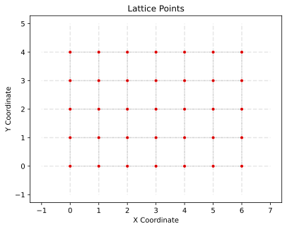
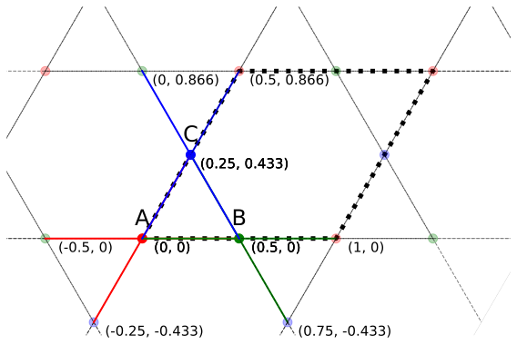
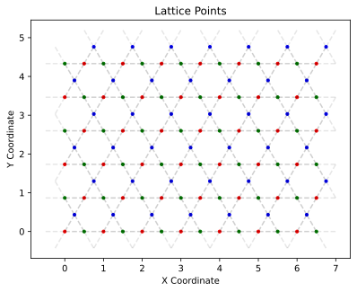

# Getting Started

Welcome to **MoirePy**! This guide will help you begin using MoirePy for research and simulations involving moiré materials.

After successfully [installing MoirePy](installation.md), this tutorial will walk you through the process of constructing moiré lattices from individual lattice layers.

As you may know, moiré patterns emerge when two lattice layers are stacked with a slight rotational misalignment between them. In this guide, we'll start by defining individual layers using MoirePy, and then demonstrate how to combine them to generate a moiré lattice.


- [Getting Started](#getting-started)
    - [Defining a layer](#defining-a-layer)
        - [Defining Some Example Lattices](#defining-some-example-lattices)
            - [Square Lattice](#square-lattice)
            - [Kagome Lattice](#kagome-lattice)
    - [Inbuilt Layers](#inbuilt-layers)


## Defining a layer

We will start by importing the parent class `Layer` from MoirePy, which helps us define single layers.

```python
>>> import numpy as np
>>> from moirepy import Layer
```

The `Layer` class handles tasks such as generating lattice points, identifying their neighbours, managing boundary conditions, efficiently searching for specific points in the lattice, and more. For `Layer` to work properly, we need to define the following properties of a lattice:

- **Lattice vectors**: These define the periodicity of the lattice. In MoirePy, they are named `lv1` and `lv2`. For simplicity, `lv1` must lie along the $x$-direction, and `lv2` must lie above the $x$-axis. This is a reasonable constraint, as any lattice can be expressed in this form.
- **Lattice points**: These are the points within the unit cell of the lattice. Each point is defined by its coordinates **relative to the unit cell**, along with a unique identifier (called a point type). The point type is useful for lattices with multiple points per unit cell (such as hexagonal or kagome lattices).
- **Neighbours**: This is a dictionary defining the neighbours of each lattice point. Each key is a point type, and its value is a list of vectors that represent the **relative positions of the neighbouring points**.

Omitting even one of these properties will result in an error.

### Defining Some Example Lattices

First, we will start with a simple square lattice, which has only one lattice point in the unit cell and four orthogonal neighbours. Then we will look at a more complex example — the kagome lattice — which has three lattice points in the unit cell and four neighbours each.

#### Square Lattice

Now let us define a square lattice using this `Layer` class.

```python
class SquareLayer(Layer):  # Inherit the Layer class
    def __init__(self, pbc=False, study_proximity: int=1) -> None:
        self.lv1 = np.array([1, 0])
        self.lv2 = np.array([0, 1])
        self.lattice_points = (
            # location of the point inside the unit cell
            [0, 0, "A"],  # coo_x, coo_y, point_type (unique string)
        )
        self.neighbours = {
            "A": [
                [-1, 0],  # Left
                [1, 0],   # Right
                [0, 1],   # Up
                [0, -1],  # Down
            ],
        }
        # do not forget to initialise the parent class at the end
        super().__init__(pbc=pbc, study_proximity=study_proximity)
```

<details open>
    <summary><strong>Things to Note</strong></summary>

	<ul>
		<li>Make sure to define all required properties for the lattice.</li>
		<li>Remember to include <code>super().__init__(pbc=pbc, study_proximity=study_proximity)</code> at the end of your <code>__init__</code> method to properly initialize the parent class.</li>
		<li>The values in <code>self.neighbours</code> are defined <em>relative to the lattice points</em>. So if the lattice point moves, the neighbour positions will automatically update — no manual changes needed.</li>
	</ul>

</details>

Now we can create an instance of this `SquareLayer` class:

```python
>>> square_layer = SquareLayer(pbc=True, study_proximity=1)
>>> square_layer
Layer(
    lv1 = [1 0],
    lv2 = [0 1],
    lattice_points = ([0, 0, 'A'],),
    pbc = True,
)
```

Next, let us try plotting this lattice. First, we need to generate the points and then plot them.

```python
>>> square_layer.generate_points(
>>>     np.array([7, 0]),
>>>     np.array([0, 5]),
>>>     1, 1, test=True
>>> )
```

Making moiré lattices requires precise cutting of the layers. This can only be done using the Moiré lattice classes. Since we’re cutting them arbitrarily here, we set `test=True` and `mln1 = mln2 = 1` to prevent the system from freaking out.

Now, we can either use the attributes `square_layer.points` and `square_layer.point_types` to manually plot the lattice, or — for quick testing — use the built-in `Layer.plot_lattice()` method. **However, we encourage you to write your own customised plotting function to better suit your preferences.**

```python
>>> square_layer.plot_lattice()
```



#### Kagome Lattice



Now let us look at a more complex lattice — the kagome lattice. This structure has three lattice points (A, B, and C, marked with red, blue, and green in the above image) in each unit cell. Each of them has four neighbours — two within the same cell and two in diagonally opposite positions to the first two.


```python
class KagomeLayer(Layer):
    def __init__(self, pbc=False, study_proximity: int=1) -> None:
        self.lv1 = np.array([1, 0])  # Lattice vector in the x-direction
        self.lv2 = np.array([0.5, np.sqrt(3)/2])  # Lattice vector at 60 degrees

        self.lattice_points = (
            [0, 0, "A"],
            [0.5, 0, "B"],
            [0.25, np.sqrt(3)/4, "C"],
        )

        self.neighbours = {
            "A": [
                [ 0.5,              0],  # Right
                [ 0.25,  np.sqrt(3)/4],  # Right-up
                [-0.5,              0],  # Left
                [-0.25, -np.sqrt(3)/4],  # Left-down
            ],
            "B": [
                [ 0.5,              0],  # Right
                [-0.25,  np.sqrt(3)/4],  # Left-up
                [-0.5,              0],  # Left
                [ 0.25, -np.sqrt(3)/4],  # Right-down
            ],
            "C": [
                [ 0.25,  np.sqrt(3)/4],  # Right-up
                [-0.25,  np.sqrt(3)/4],  # Left-up
                [-0.25, -np.sqrt(3)/4],  # Left-down
                [ 0.25, -np.sqrt(3)/4],  # Right-down
            ],
        }
        super().__init__(pbc=pbc, study_proximity=study_proximity)
```

Now let us plot this lattice as well.

```python
>>> kagome_layer = KagomeLayer(pbc=True, study_proximity=1)
>>> kagome_layer.generate_points(
>>>     np.array([7, 0]),
>>>     np.array([0, 5]),
>>>     1, 1, test=True,
>>> )
>>> kagome_layer.plot_lattice()
```




## Inbuilt Layers

Although we highly recommend defining your own layers for research purposes, MoirePy provides a few basic lattices for quick testing and prototyping. These are available in the `moirepy.layers` module. Here’s a list of the available layers:

- `moirepy.SquareLayer`: A simple square lattice as shown above.
- `moirepy.TriangularLayer`: A triangular lattice with $60^\circ$ angles.
- `moirepy.HexagonalLayer`: A hexagonal lattice with $60^\circ$ angles and two points per unit cell.
- `moirepy.KagomeLayer`: A kagome lattice as shown above.

Here are the blueprints of these lattices:


<div style="display: flex; justify-content: center; gap: 20px; align-items: flex-start; flex-wrap: wrap;">

  <figure style="margin: 0; text-align: center;">
    
    <figcaption style="margin-top: 8px; font-style: italic;">Square Lattice</figcaption>
  </figure>

  <figure style="margin: 0; text-align: center;">
    
    <figcaption style="margin-top: 8px; font-style: italic;">Triangle Lattice</figcaption>
  </figure>

  <figure style="margin: 0; text-align: center;">
    
    <figcaption style="margin-top: 8px; font-style: italic;">Hexagon Lattice</figcaption>
  </figure>

  <figure style="margin: 0; text-align: center;">
    
    <figcaption style="margin-top: 8px; font-style: italic;">Kagome Lattice</figcaption>
  </figure>

</div>

Now that you've seen how to define custom layers — and also explored the inbuilt ones — you should have a good understanding of how individual lattices are represented in MoirePy.

We encourage you to experiment with creating your own layer classes suited to your specific research needs. The inbuilt layers are helpful for quick prototyping, but the real power of MoirePy lies in its flexibility.

---

In the next section, we’ll explore how to **combine two layers into a moiré superlattice**, and how to use these structures to **build tight-binding Hamiltonians** and compute physical observables.
