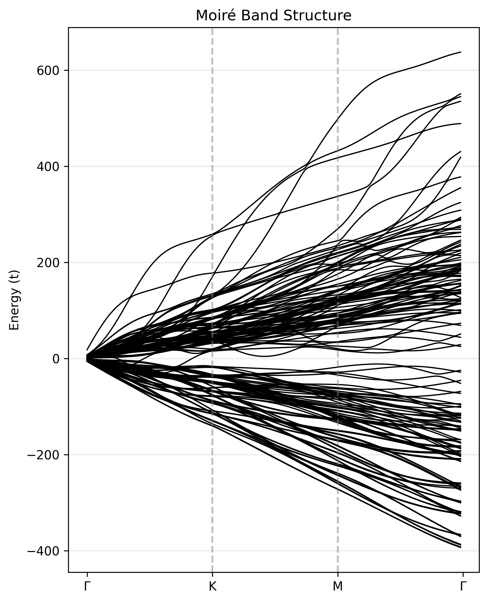

# K-Space Hamiltonian and Band Structure

In this section, we will see how to generate the k-space Hamiltonian for a moiré system and compute its band structure. This is essential for understanding the electronic properties of the system, such as the presence of flat bands or Dirac cones.

## 1. Recap and Setup

To work in k-space, **Periodic Boundary Conditions (`pbc=True`) are strictly required**. Momentum is only a well-defined quantum number in a periodic system; without PBC, there is no Brillouin Zone to sample.

```python
import numpy as np
import matplotlib.pyplot as plt
from moirepy import BilayerMoireLattice, HexagonalLayer

lattice = BilayerMoireLattice(
    latticetype=HexagonalLayer,
    ll1=3, ll2=4,
    ul1=4, ul2=3,
    n1=1, n2=1,
    pbc=True # Mandatory for k-space
)
```

---

## 2. Single k-point Generation

A k-space Hamiltonian represents the system's energy at a specific crystal momentum. Note that these matrices are complex-valued even if your hopping parameters are real numbers.

```python
k = np.array([0.1, 0.2])

# Matrices are smaller but complex: we use complex128 internally
Hk = lattice.generate_k_space_hamiltonian(
    k=k,
    tll=1.0, tuu=1.0,
    tul=0.1, tlu=0.1, # User must ensure tlu = conj(tul) for Hermiticity
)

print(f"Matrix shape: {Hk.shape}")

```

!!! warning "Manual Hermiticity"
    MoirePy gives you raw control over the hopping directions. To maintain a physical, Hermitian Hamiltonian, you must ensure your `tlu` (Lower to Upper) values are the complex conjugates of your `tul` (Upper to Lower) terms.

---

## 3. Band Structure Calculation (The Physics Payoff)

The primary use of k-space is to visualize how energy levels evolve across the **Moiré Brillouin Zone (MBZ)**.

### Step 1: Define the Path

We sample the zone by interpolating between High-Symmetry points ().

```python
# Defined using the reciprocal lattice vectors of the moire system
G = np.array([0, 0])
K = (1/3) * (lattice.mlv1 + lattice.mlv2) 
M = (1/2) * lattice.mlv1

def get_path(points, steps=50):
    path = []
    for i in range(len(points) - 1):
        for t in np.linspace(0, 1, steps):
            path.append(points[i] * (1 - t) + points[i + 1] * t)
    return np.array(path)

k_path = get_path([G, K, M, G])

```

### Step 2: Iterative Solver

Since k-space Hamiltonians represent a single unit cell, they are much smaller than real-space matrices. We can use dense solvers like `np.linalg.eigvalsh` for high precision.

```python
bands = []

for k in k_path:
    Hk = lattice.generate_k_space_hamiltonian(
        k=k, tll=1.0, tuu=1.0, tul=0.1, tlu=0.1
    )
    # Convert sparse k-matrix to dense for the eigensolver
    eigvals = np.linalg.eigvalsh(Hk.toarray())
    bands.append(eigvals)

bands = np.array(bands)

```

### Step 3: Visualization

```python
plt.figure(figsize=(6, 8))
plt.plot(bands, color='black', linewidth=1)

# Mark the high-symmetry transitions
plt.axvline(x=50, linestyle='--', color='gray', alpha=0.5)
plt.axvline(x=100, linestyle='--', color='gray', alpha=0.5)

plt.xticks([0, 50, 100, 150], [r'$\Gamma$', 'K', 'M', r'$\Gamma$'])
plt.ylabel("Energy (t)")
plt.title("Moiré Band Structure")
plt.grid(axis='y', alpha=0.3)
plt.show()

```

{: style="max-width: 50%;" }

!!! note
    Using constant hopping ($t=1$) over a large supercell results in a dense, folded band structure. To see the isolated flat bands characteristic of the Magic Angle, refer to the Replicated Papers section where we implement distance-dependent (exponential) hopping.

---

## Summary

- We constructed the k-space Hamiltonian from the same lattice definition  
- We sampled momentum space along a high-symmetry path  
- We computed and visualized the band structure  

This is the standard workflow for studying electronic structure in periodic moiré systems.

---

## Next Steps

1. **[OBC vs PBC](obc_vs_pbc.md)**: Understand how boundary conditions affect the Hamiltonian.  
2. **[Defining Custom Layers](prepare_layers.md)**: Go beyond built-in lattices.  
3. **[Designing Custom Hopping](custom_hoppings.md)**: Introduce realistic physics.  
4. **[Tutorials and Replicated Papers](../examples.md)**: See full physical results.  
