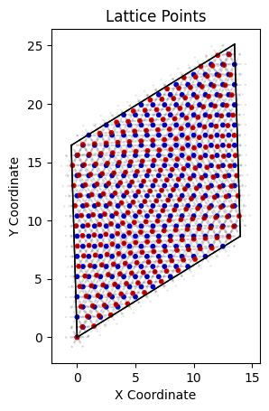
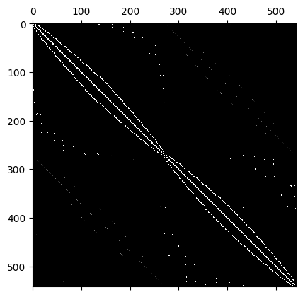

# Preparing Moiré Lattice and it's Hamiltonian

In the previous section, we learned how to prepare a lattice layer using the `Layer` class. Now, we will extend this knowledge to create a Moiré lattice and its Hamiltonian.

## Generate Moiré Lattice

Assuming you have written your own `Layer` subclasses, for this tutorial we will use the inbuilt `TriangleLayer` for simplicity. We will create a bilayer Moiré lattice using the `BilayerMoireLattice` class where both the lower and upper layers are of the same type (`TriangleLayer` in this case).

!!! warning
    For now we only support Moiré lattices where both layers are of the same type. We will shortly add support for lattices with different types of layers.


```python
>>> # Import the necessary classes
>>> from moirepy import BilayerMoireLattice, TriangularLayer
>>> # Define the Moiré lattice with two triangular layers
>>> moire_lattice = BilayerMoireLattice(
>>>     latticetype=TriangularLayer,
>>>     ll1=9, ll2=10,
>>>     ul1=10, ul2=9,
>>>     n1=1, n2=1,  # number of unit cells
>>> )
twist angle = 0.0608 rad (3.4810 deg)
271 points in lower lattice
271 points in upper lattice
>>> # Plot the Moiré lattice
>>> moire_lattice.plot_lattice()
```




The values `ll1`, `ll2`, `ul1`, and `ul2` are supposed to be obtained from the [Angle Value Calculator](../theory/avc.md) tool. In this page you have to input the layer types and the radius till which you want to search for overlaps. The tool will then search for all the overlaps and return the values of `ll1`, `ll2`, `ul1`, and `ul2` along with the twist angle and the number of points in each layer. Choose the appropriate values of `ll1`, `ll2`, `ul1`, and `ul2` based on the desired twist angle.

**For more information about the options that can be tweaked please check the related API reference.**

## Obtain the real space Hamiltonian of this Moiré lattice

Obtaining the Hamiltonian in MoiréPy is as easy as calling the `BilayerMoireLattice.generate_hamiltonian` function with the intended hopping parameters. Let's see how:

```python
>>> # with the already generated `moire_lattice`
>>> ham = moire_lattice.generate_hamiltonian(
>>>     tll=1, tuu=1, tlu=1, tul=1,
>>>     tuself=1, tlself=1,
>>> )
>>> ham
array([[1., 1., 0., ..., 0., 0., 0.],
       [1., 1., 1., ..., 0., 0., 0.],
       [0., 1., 1., ..., 0., 0., 0.],
       ...,
       [0., 0., 0., ..., 1., 1., 0.],
       [0., 0., 0., ..., 1., 1., 1.],
       [0., 0., 0., ..., 0., 1., 1.]], shape=(542, 542))
```

The shape of the Hamiltonian is $(n, n)$, where:

$$
\begin{aligned}
n &= \text{\#lattice points} \times \text{\#orbitals per site } (=k) \\
  &= (271_\text{upper} + 271_\text{lower}) \times (k=1) = 542
\end{aligned}
$$

This matches the shape $(542, 542)$ shown in the example.

let us now try visualising the obtained hamiltonian:

```python
>>> import matplotlib.pyplot as plt
>>> plt.matshow(ham, cmap="gray")
```


### Customising the Hopping Parameters

The hopping parameters `tll`, `tuu`, `tlu`, `tul`, `tuself`, and `tlself` can be customized when generating the Hamiltonian. All of them can sure take float or integer values (as demonstrated above). But instead of that, you can pass a function as input to these parameters as well. Before seeing how to write that function, we need to understand what these parameters mean:

- `tll`: hopping between neighbours on lower lattice
- `tuu`: hopping between neighbours on upper lattice
- `tlu`: hopping from lower lattice to upper lattice
- `tul`: hopping from upper lattice to lower lattice
- `tlself`: on-site energy for lower lattice
- `tuself`: on-site energy for upper lattice

for `tll`, `tuu`, `tlu` and `tul` we have to write a function that takes in these values:

- `this_coo` (float, float): 2D coordinate of the current site.
- `neigh_coo` (float, float): 2D coordinate of the neighboring site.
- `this_type` (string): Type of the current site (as defined in your `sublattice.lattice_points`).
- `neigh_type` (string): Type of the neighboring site (as defined in `sublattice.lattice_points`).

The function should return the desired hopping value for the given pair of sites. This allows you to implement position or type-dependent hopping amplitudes.

However in case of lattices with higher number of orbitals per site, you have to return a `(k, k)` shaped numpy array. More about this in [Examples](../examples.md) section.

On the other hand `tlself` and `tuself` are single point operations. So they take in only two values:

- `this_coo` (int): The coordinate of the current site.
- `this_type` (string): The type of the current site (as defined in your `sublattice.lattice_points`).

Now let us look into an example:

```python
>>> def inter_layer_hopping(this_coo, neigh_coo, this_type, neigh_type):
>>>     distance_between_layers = 1
>>>     this_coo_3D = np.array([*this_coo, 0])
>>>     neigh_coo_3D = np.array([*neigh_coo, distance_between_layers])
>>>     distance = np.linalg.norm(this_coo_3D - neigh_coo_3D)
>>>     # hopping parameter as a function of distance
>>>     return 4 * (distance - 1)
>>> ham = moire_lattice.generate_hamiltonian(
>>>     tll=1, tuu=1,
>>>     tlu=inter_layer_hopping,
>>>     tul=inter_layer_hopping,
>>>     tuself=1, tlself=1
>>> )
>>> plt.matshow(ham, cmap="gray")
```



!!! note
    - Although the `inter_layer_hopping` function takes in the values `this_type` and `neigh_type`, they are not used in this example. You can use them in your problem if you want, but not using them (as in this example) is perfectly fine too. However, you must take them as input parameters in the function definition.
    - In case of PBC, the `neigh_coo` might not actually be a point in the lattice for boundary points. The actual neigbouring point might be on the other side of the boundary. This is a design choice in MoiréPy, and we think it is more intuitive to handle the periodic boundary conditions this way. However, if you want to get the actual neighbouring point in the lattice, we will add an example notebook for that (not yet done).

We will explore more examples of custom hopping parameters, and interesting ways to use them in the [Examples](../examples.md) section.

## Obtaining the k-space Hamiltonian of this Moiré lattice

To obtain the k-space Hamiltonian, we can use the `generate_kspace_hamiltonian` method of the `BilayerMoireLattice` class. This method will compute the Hamiltonian in momentum space based on the real space Hamiltonian we generated earlier. The inputs are all the same as the ones we used for generating the real space Hamiltonian, but now we also need to specify a `k` point at which to evaluate the Hamiltonian.

```python
>>> kspace_ham = moire_lattice.generate_k_space_hamiltonian(
>>>     k = (0, 0), # k-point at which to evaluate the Hamiltonian
>>>     tll=1, tuu=1,
>>>     tlu=inter_layer_hopping,
>>>     tul=inter_layer_hopping,
>>>     tuself=1, tlself=1
>>> )
>>> kspace_ham
array([[1.+0.j, 1.+0.j, 0.+0.j, ..., 0.+0.j, 0.+0.j, 0.+0.j],
       [1.+0.j, 1.+0.j, 1.+0.j, ..., 0.+0.j, 0.+0.j, 0.+0.j],
       [0.+0.j, 1.+0.j, 1.+0.j, ..., 0.+0.j, 0.+0.j, 0.+0.j],
       ...,
       [0.+0.j, 0.+0.j, 0.+0.j, ..., 1.+0.j, 1.+0.j, 0.+0.j],
       [0.+0.j, 0.+0.j, 0.+0.j, ..., 1.+0.j, 1.+0.j, 1.+0.j],
       [0.+0.j, 0.+0.j, 0.+0.j, ..., 0.+0.j, 1.+0.j, 1.+0.j]],
      shape=(542, 542))
```

The k-space Hamiltonian is by default a complex-valued matrix. The real hamiltonian is a real-valued matrix by default, but if you want to pass complex valued hopping parameters, you can do so after specifying `data_type = np.complex128` in the `generate_hamiltonian` method.

---

<br>

In this section, we have learned how to create a Moiré lattice using the `BilayerMoireLattice` class and generate its Hamiltonian in both real and k-space. We also touched upon how to customize the hopping parameters using functions. This sets the foundation for further exploration of Moiré lattices and their properties in MoiréPy.

Currently, this is all we have in MoiréPy for Moiré lattices. We will be adding more features and functionalities in the future as we continue to develop the library. Please raise issues on the [GitHub repository](https://github.com/yourusername/MoirePy/issues) if you have any suggestions, want to raise feature requests or encounter any problems.

After calculating the Hamiltonians using MoirePy, we expect you to use other more specific libraries like `numpy`, `scipy`, `kwant` etc. to perform further analysis.
