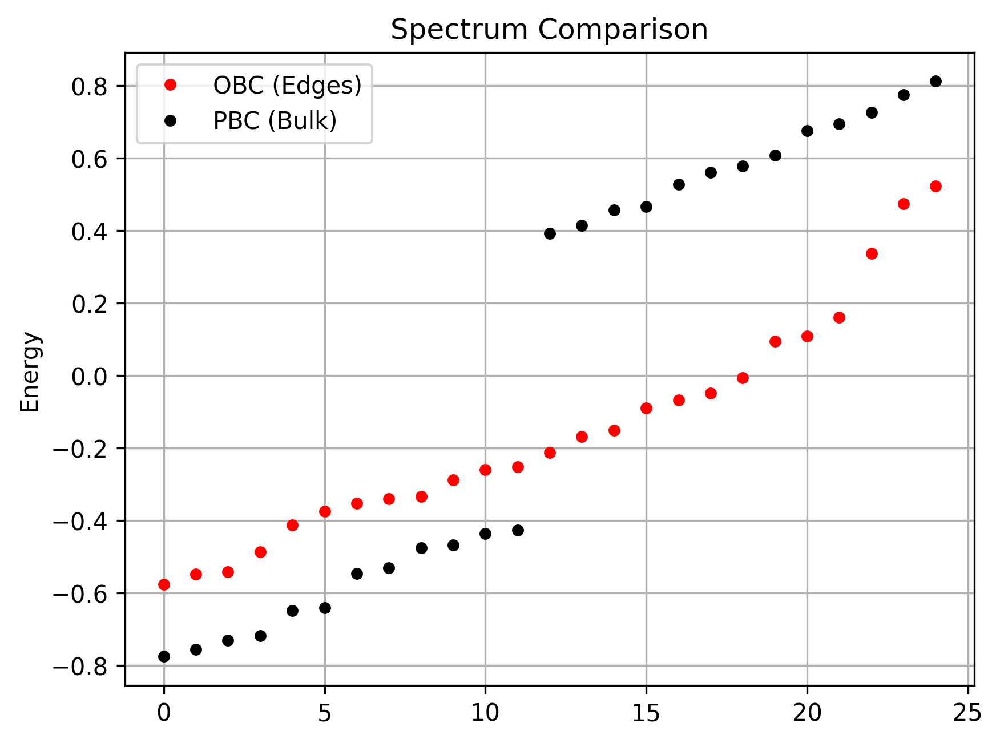

# Simulating Lattices: OBC vs. PBC

In this section, you will learn how to simulate both **Periodic Boundary Conditions (PBC)** and **Open Boundary Conditions (OBC)** using MoirePy. Understanding the transition between these two is vital for distinguishing between bulk properties and edge-specific phenomena.

---

## 1. Physical Difference: Bulk vs. Flake

* **PBC (`pbc=True`)**: Represents an **infinite periodic system**. Atoms at the boundary "wrap around" to connect with atoms on the opposite side of the moiré unit cell, simulating an endless bulk material.
* **OBC (`pbc=False`)**: Represents a **finite flake or nanostructure**. Atoms at the boundaries have fewer neighbors because the lattice physically ends, creating edges.

---

## 2. Minimal Setup

We define the same lattice geometry once, toggling only the `pbc` flag to see how it changes the connectivity.

```python
import numpy as np
import matplotlib.pyplot as plt
from moirepy import BilayerMoireLattice, HexagonalLayer

# Parameters for a ~9.43 degree twist
params = {
    "latticetype": HexagonalLayer,
    "ll1": 3, "ll2": 4, "ul1": 4, "ul2": 3,
    "n1": 1, "n2": 1
}  # yes, u can do this in python

# 1. Open Boundary Conditions (Finite Flake)
lattice_obc = BilayerMoireLattice(**params, pbc=False)

# 2. Periodic Boundary Conditions (Infinite Bulk)
lattice_pbc = BilayerMoireLattice(**params, pbc=True)
```

---

## 3. Hamiltonian and Connectivity

The internal logic for finding neighbors changes significantly. In PBC, MoirePy uses a **KDTree** on a set of "ghost" atoms (bigger lattice) to ensure that atoms near the edge find their counterparts on the other side.

```python
# Generate Hamiltonians with identical hopping parameters
ham_obc = lattice_obc.generate_hamiltonian(tll=1.0, tuu=1.0, tul=0.1, tlu=0.1)
ham_pbc = lattice_pbc.generate_hamiltonian(tll=1.0, tuu=1.0, tul=0.1, tlu=0.1)

print(f"OBC Non-zero entries: {ham_obc.nnz}")  # 6062
print(f"PBC Non-zero entries: {ham_pbc.nnz}")  # 9728

```

!!! info Automatic Neighbor Wrapping
    In **PBC**, an atom at the far right edge connects to a neighbor at the far left edge. MoirePy handles this mapping automatically. You don't need to manually calculate wrapped coordinates. This results in a higher number of non-zero entries (`nnz`) in the PBC Hamiltonian.

---

## 4. Visual Comparison (Hamiltonian Structure)

Let's plot the hamiltonian matrices and let's see how they look like:

```python
plt.imshow(ham_obc.toarray(), cmap="gray")
plt.imshow(ham_pbc.toarray(), cmap="gray")
```


---

## 5. Spectrum Comparison

The choice of boundary conditions significantly affects the energy eigenvalues. OBC introduces "edge states" that may appear in gaps where the bulk (PBC) system has no states.

```python
from scipy.sparse.linalg import eigsh

def get_spectrum(ham):
    # Get 100 eigenvalues near zero energy
    vals = eigsh(ham, k=100, which='LM', sigma=0, return_eigenvectors=False)
    return np.sort(vals)

spec_obc = get_spectrum(ham_obc)
spec_pbc = get_spectrum(ham_pbc)

plt.plot(spec_obc, 'ro', label='OBC (Edges)', markersize=4)
plt.plot(spec_pbc, 'k.', label='PBC (Bulk)', markersize=4)
plt.legend()
plt.ylabel("Energy")
plt.title("Spectrum Comparison")
plt.show()
```



---

## What We Did

* Constructed the same lattice with OBC and PBC  
* Observed how connectivity changes at the boundaries  
* Compared Hamiltonians and resulting spectra  

This demonstrates how boundary conditions control whether you simulate a finite system or an infinite periodic system.

---

## Next Steps

1. **[K-Space & Band Structures](k_space_hamiltonian.md)**: Work in momentum space for periodic systems.  
2. **[Defining Custom Layers](prepare_layers.md)**: Build your own lattice geometries.  
3. **[Designing Custom Hopping](custom_hoppings.md)**: Add realistic physics.  
4. **[Tutorials and Replicated Papers](../examples.md)**: See full physical results.  
