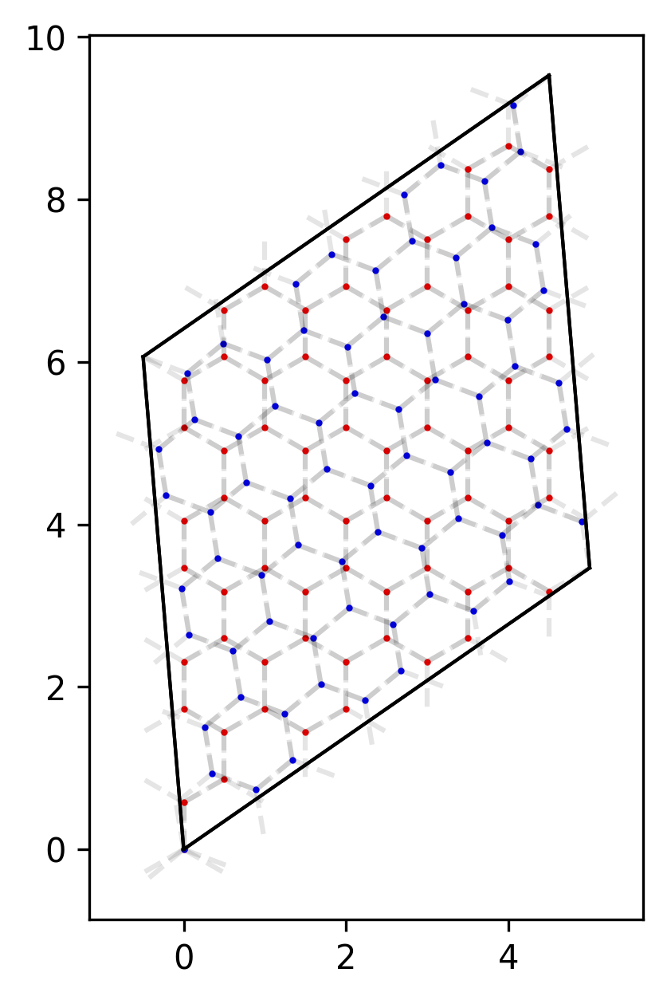
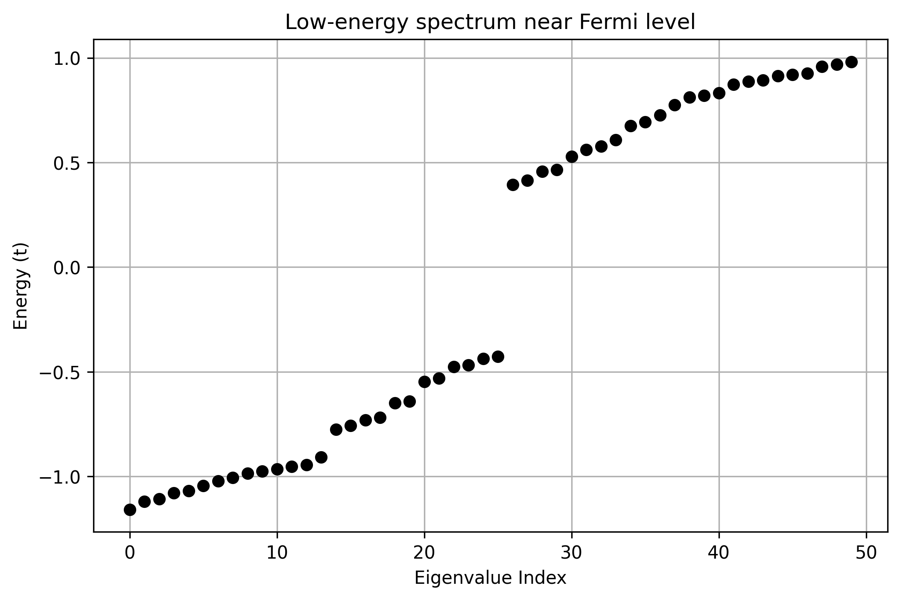

# Quickstart: Twisted Bilayer Graphene in 5 Minutes

In this tutorial, you will simulate **Twisted Bilayer Graphene (TBG)** from scratch. MoirePy abstracts the geometric complexity of commensurate lattice construction, allowing you to go from a twist angle to a Hamiltonian in seconds.

---

## 1. Minimal Installation

```bash
pip install moirepy

```

---

## 2. Construct the Moire Lattice

We use the built-in `HexagonalLayer` (Graphene) to construct the bilayer. While this example focuses on graphene, MoirePy includes several other built-in geometries:

* **`SquareLayer`**
* **`TriangularLayer`**
* **`KagomeLayer`**
* **`Rhombus60Layer`**

You can also define your own entirely unique geometries; see [Defining Custom Layers](prepare_layers.md) for more.

```python
import numpy as np
import matplotlib.pyplot as plt
from moirepy import BilayerMoireLattice, HexagonalLayer

# Define a commensurate TBG lattice
lattice = BilayerMoireLattice(
    latticetype=HexagonalLayer,
    # Indices for a ~9.43 degree twist
    # Find these via our tool: https://jabed-umar.github.io/MoirePy/theory/avc/
    ll1=3, ll2=4, ul1=4, ul2=3, 
    n1=1, n2=1,    # Number of moiré unit cells
    pbc=True,      # Periodic Boundary Conditions, set False for OBC
    verbose=True   # Displays twist angle and atom counts
)

# Visualize the atomistic structure
lattice.plot_lattice()
plt.show()
```
{: style="max-width: 50%;" }

---

## 3. Generate the Hamiltonian

MoirePy separates **geometry** (KDTree-based neighbor search) from **physics** (hopping values). You can pass constants or custom functions for every term.

### Real-Space Hamiltonian

Ideal for studying local defects or large-scale samples under **Open Boundary Conditions (OBC)**.

```python
# Returns a scipy.sparse.csc_matrix
ham = lattice.generate_hamiltonian(
    tll=1.0,      # Lower-layer intra-layer hopping
    tuu=1.0,      # Upper-layer intra-layer hopping
    tul=0.1,      # Inter-layer hopping (Upper -> Lower)
    tlu=0.1,      # Inter-layer hopping (Lower -> Upper)
    tlself=0.0,   # Lower-layer onsite potential
    tuself=0.0,   # Upper-layer onsite potential
    inter_layer_radius=3 # Cut-off circle for interlayer search
)

print(f"Hamiltonian Dimension: {ham.shape}")
# Output: Hamiltonian Dimension: (148, 148)

```

!!! warning
    For a Hermitian system, ensure that your `tlu` function/value is the complex conjugate of `tul`. MoirePy does not enforce this automatically by design.

<!-- > [!WARNING]
> For a Hermitian system, ensure that your `tlu` function/value is the complex conjugate of `tul`. MoirePy does not enforce this automatically by design. -->

### k-Space Hamiltonian

Essential for band structure calculations. Switching to momentum space requires no structural changes to your logic.

```python
# k-point at the Gamma point (0, 0)
kham = lattice.generate_k_space_hamiltonian(
    k=np.array([0, 0]),
    tll=1.0, tuu=1.0, 
    tul=0.1, tlu=0.1, 
    tlself=0.0, tuself=0.0
)
```

---

## 4. Compute Low-Energy States

Because the Hamiltonian is returned as a standard SciPy sparse matrix, it integrates perfectly with the scientific Python ecosystem.

```python
from scipy.sparse.linalg import eigsh

# Find the 20 eigenvalues closest to zero
eigenvalues = eigsh(ham, k=50, which='LM', sigma=0, return_eigenvectors=False)

plt.scatter(range(len(eigenvalues)), np.sort(eigenvalues), color='black')
plt.ylabel("Energy (t)")
plt.title("Low-energy spectrum near Fermi level")
plt.show()
```



---

## The "Getting Started" Roadmap

Now that you've built your first lattice, dive deeper into the core mechanics:

1. **[K-Space & Band Structures](k_space_hamiltonian.md)**: How to generate k-space Hamiltonians and compute band structures.
2. **[OBC vs PBC](obc_vs_pbc.md)**: How we can simulate both infinite and finite systems using PBC and OBC respectively.
3. **[Defining Custom Layers](prepare_layers.md)**: Move beyond graphene to MoS2, Square lattices, or Kagome.
4. **[Designing Custom Hopping](custom_hoppings.md)**: How to implement distance-dependent (exponential) hopping or strain.
5. **[Tutorials and Replicated Papers](../examples.md)**: See full physical results.