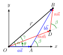
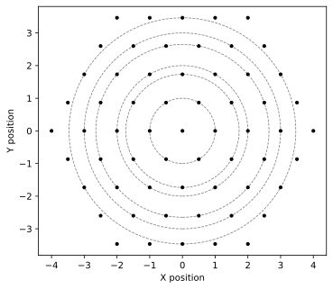
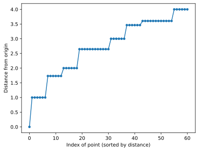

# Angle Calculation Process

When two single layers of a 2D material are stacked with a small misalignment, they produce a moiré pattern with a length scale much larger than the periodicity of either individual layer. At specific twist angles, this results in a ***commensurate moiré pattern***; a structure where atoms from one layer align exactly with those of the other.

In this section, we describe how **MoirePy** calculates the ***commensurate rotation angles*** between two lattices confined to a bounded region. The goal is to identify angles where the lattices align periodically, producing well-ordered moiré patterns that are physically observable.

## 1. Problem Statement

Let lattices $A$ and $B$ be two periodic point sets in two dimensions, each defined by their respective lattice vectors.

We address the following geometric question:

**Given** a rotation angle $\theta$, **does there exist** a point $\mathbf{p} \in A$ and a point $\mathbf{q} \in B$ such that

$$
\mathbf{p} = R(\theta)\mathbf{q}
\tag{1.1}
$$

where $R(\theta)$ denotes the standard rotation matrix. In 2D, this matrix is defined as:

$$
R(\theta) =
\begin{bmatrix}
\cos\theta & -\sin\theta \\
\sin\theta & \cos\theta
\end{bmatrix}
\tag{1.2}
$$

To bound the computation, we restrict our analysis to a finite region by considering only lattice points within a circular region of radius $r$. Let the truncated sets be $A_r = A \cap \text{circle}(r)$ and $B_r = B \cap \text{circle}(r)$.

Our goal is to determine the set of angles $\theta$ (including the corresponding points) for which there exists a pair of points $\mathbf{p} \in A_r$ and $\mathbf{q} \in B_r$ satisfying Equation 1.1.

These angles correspond to commensurate alignments between the two lattices, yielding physically observable moiré patterns.

## 2. Traditional Diophantine Equation Approach

In commensurate moiré superlattices, specific periodic points exist where atoms from the top and bottom layers align exactly. To analyze these alignments, let $(\vec{a}, \vec{b})$ and $(\vec{m}, \vec{n})$ denote the primitive lattice vectors of the lower and upper layers, respectively. The atomic positions in each layer are given by:

$$
\vec{R}^1_{p,q} = a\vec{a} + b\vec{b} \quad \text{and} \quad
\vec{R}^2_{m,n} = R(\theta)(m\vec{m} + n\vec{n}), \quad a, b, m, n \in \mathbb{Z}
$$

*
<strong>Fig 1:</strong> Illustration of vector matching for commensurate moiré patterns. Here vectors m and n are already rotated by angle theta. 
*

For a commensurate moiré superlattice to form, there must exist integers $a, b, m, n$ such that:

$$\vec{R}^1_{p,q} = \vec{R}^2_{m,n}$$

This leads to a condition based on vector magnitudes and orientations:

$$
\vec{a} \cdot \vec{b} = \vec{m} \cdot \vec{n} = \cos{\beta} = \frac{m^2 + n^2 - a^2 - b^2}{2(ab - mn)}
\tag{2.1}
$$

We need to find all integer quadruples (a, b, m, n) satisfying Equation 2.1. Then, the corresponding twist angle $\theta$ can then be computed.

The computation proceeds as follows. The length of the moiré lattice vector $\vec{r}$ connecting equivalent lattice points is:

$$
r = |\vec{r}| = \sqrt{a^2 + b^2 + 2ab\cos\beta}
$$

Using the Law of Sines, we calculate the intermediate angles $\alpha$ and $\gamma$:

$$
\frac{b}{\sin\alpha} = \frac{r}{\sin(180^\circ - \beta)} \quad \Rightarrow \quad
\alpha = \sin^{-1}\left(\frac{b \sin\beta}{r}\right)
\tag{2.2}
$$

$$
\frac{n}{\sin\gamma} = \frac{r}{\sin(180^\circ - \beta)} \quad \Rightarrow \quad
\gamma = \sin^{-1}\left(\frac{n \sin\beta}{r}\right)
\tag{2.3}
$$

The twist angle $\theta$ between the two layers is then:

$$
\theta = \alpha - \gamma = \sin^{-1}\left(\frac{b \sin\beta}{r}\right) - \sin^{-1}\left(\frac{n \sin\beta}{r}\right)
$$

This classical Diophantine approach provides a rigorous framework for determining commensurate twist angles where the lattice vectors form periodic overlaps.

### Time Complexity

The general approach involves iterating over all possible values of the first three variables ($a$, $b$, $m$) and computing the fourth variable ($n$) based on the condition in Equation 2.1. A valid solution exists when $n$ is an integer.

This brute-force search results in a time complexity of $O(n^3)$, where $n$ represents the maximum value of the variables (starting from 0). For large $n$ (i.e., when considering dense lattice points), this cubic complexity becomes computationally prohibitive. We wanted to find a better solution.

## Observations About Lattice Structure

When examining regularly spaced lattices (like triangular or square lattices), we observed several useful structural properties. As shown in Fig. 2, lattice points naturally organize into concentric circles around the origin. If we sort all points by their distance from the origin, we see distinct discrete levels forming - similar to a step function. Each level (corresponding to a specific radius) contains symmetrically arranged points. For instance, in triangular lattices, each level contains a multiple of 6 points due to the lattice's 6-fold rotational symmetry (Fig. 3). (Similarly we see in Square lattice, a multiple of 4 points per level.)

  <figure style="margin: 0; text-align: center;">
    
    <figcaption style="margin-top: 8px; font-style: italic;"><strong>Fig 2:</strong> Lattice points reside in concentric circles</figcaption>
  </figure>

  <figure style="margin: 0; text-align: center;">
    
    <figcaption style="margin-top: 8px; font-style: italic;"><strong>Fig 3:</strong> Number of points in each shell is a multiple of 6 (Triangle lattice)</figcaption>
  </figure>

This symmetric distribution has an important consequence: when two lattices share the same radial level, we only need to align one pair of points at that level. The remaining 5 symmetric points will automatically align due to the lattice symmetry, significantly reducing the computational effort needed to find commensurate angles.

## Our Method

Our approach leverages lattice geometry and symmetry rather than algebraic equations to identify commensurate rotation angles. The method operates directly on the spatial distribution of lattice points, and hence is applicable for any regular lattice structure even stacking two different ones.

### Algorithm Overview

Let $A_r$ and $B_r$ be the sets of lattice points (from lattice A and B respectively) within radius $r$ from the origin.

1. **Group points by radius**:
    For each point ($\mathbf{p}$) in $A_r$ and $B_r$, compute its distance $d = \|\mathbf{p}\|$ from the origin.
    In each lattice, group points that lie at the same radius into *shells* or *levels*.

2. **Identify shared levels**:
    Let $D = \{d \mid d \text{ occurs in both } A_r \text{ and } B_r \} \setminus \{0\}$.
    These are the non-zero radii at which both lattices have points.

3. **Compute angle differences (Candidate Generation)**:
    For each shared radius $d \in D$, we look at every point $\mathbf{p_1} \in A_r$ and $\mathbf{p_2} \in B_r$ situated at that distance. 
    To halve the search space and avoid mirror-image duplicates, we ignore any points where $y < 0$.
    For each valid pair $(\mathbf{p_1}, \mathbf{p_2})$, we calculate the rotation angle needed to map $\mathbf{p_1}$ to $\mathbf{p_2}$:

    $$ \theta = (\angle\mathbf{p_2} - \angle\mathbf{p_1}) \pmod{360^\circ} $$

    If $\theta$ falls within our requested angular range (e.g. $0^\circ < \theta < \theta_\text{max}$), we record this as a candidate match.

4. **Clash Resolution & Deduplication**:
    The candidate list is sorted by rotation angle $\theta$. Because the lattice is highly symmetric, many different pairs of points will yield the exact same rotation angle. 
    We group candidates whose angles match. For each group of duplicate angles, we keep only one winner using the following heuristics:
    - **Primary choice**: The pair belonging to the *smallest radius* shell wins. This ensures we select the smallest possible moiré supercell (i.e., the fundamental unit cell rather than a larger multiple).
    - **Tie-breaker**: If radii are equal, we select the pair whose orientation (the azimuthal angle of the vector sum of its super lattice basis vectors) is closest to $0^\circ$. This is done purely for cosmetic purposes. All the other candidates are geometrically equivalent to this one.

  
Some Practical Optimizations

    <ul>
        <li>
          <strong>Y-axis Filtering:</strong> As mentioned in Step 3, any point with a negative Y-coordinate is skipped outright. Any match involving a lower-half point simply manifests as a geometrically equivalent match further down the pipeline. Stripping them early cuts the inner $O(N^2)$ loop iterations by $75\%$.
        </li>
        <li>
          <strong>Excluding zero distance:</strong> The origin $(0, 0)$ is explicitly removed from the shared levels $D$. The origin always maps to itself under any rotation, providing no useful geometric constraints for resolving $\theta$.
        </li>
    </ul>
    

 

### Time Complexity

If the number points is of the order $O(n^2)$ and they are sorted by distance, the time complexity of this part becomes $O(n^2 \log n^2) =  O(n^2 \log n)$ (because $\log n^2 = 2 \log n$). Apart from this all other steps are multiple order smaller than this cost, hence can be ignored. That makes this algorithm much less than the $O(n^3)$ of the Diophantine approach and arguably more intuitive.

### Calculating the super-lattice vectors

Once the process has identified a valid commensurate angle $\theta$ and its corresponding overlapping point, the algorithm computes integer indices `ll1, ll2` (for the lower layer) and `ul1, ul2` (for the upper layer). These indices describe how to reach the coincidence point $\mathbf{p}$ using the primitive basis vectors of the respective layers.

To actually construct the moiré supercell geometry, we need the large **moiré lattice vectors** ($\mathbf{m_{lv1}}$ and $\mathbf{m_{lv2}}$). Because a moiré lattice inherits the point-group symmetry of its constituent layers, the second moiré vector is just the first vector rotated by the natural angle between the monolayer's basis vectors ($\beta$).

Mathematically, this is expressed as follows:

1. **Find the inherent angle between the monolayer's basis vectors ($\beta$)**:  
   Let $\mathbf{a_1}$ and $\mathbf{a_2}$ be the primitive lattice vectors of the given monolayer. For different types of layers in upper and lower, we . The angle $\beta$ between them is found using the dot product:
   
   $$ \beta = \cos^{-1}\left( \frac{\mathbf{a_1} \cdot \mathbf{a_2}}{|\mathbf{a_1}| |\mathbf{a_2}|} \right) $$

2. **Compute the first super-lattice vector ($\mathbf{m_{lv1}}$)**:  
   The coincidence point directly gives us the first super-lattice vector. Using the lower layer indices ($l_1$, $l_2$) returned by the algorithm:
   
   $$ \mathbf{m_{lv1}} = l_1 \mathbf{a_1} + l_2 \mathbf{a_2} $$

3. **Compute the second super-lattice vector ($\mathbf{m_{lv2}}$)**:  
   To preserve the underlying lattice symmetry in the moiré pattern, the second vector is simply the first one rotated by $\beta$:
   
   $$ \mathbf{m_{lv2}} = R(\beta)\mathbf{m_{lv1}} $$
   
   where $R(\beta)$ is the standard 2D rotation matrix:
   
   $$
   R(\beta) =
   \begin{bmatrix}
   \cos\beta & -\sin\beta \\
   \sin\beta & \cos\beta
   \end{bmatrix}
   $$

These two vectors, $\mathbf{m_{lv1}}$ and $\mathbf{m_{lv2}}$, span the exact boundaries of the commensurate moiré supercell, which can then be populated with the individual atoms of both layers.

We avoided solving Diophantine equations by leaning on geometry and symmetry:

- Points are grouped by radius
- Only overlapping radii are considered
- Pairwise angle differences yield the commensurate angles

This makes **MoirePy**'s angle detection both **fast and visual**, and opens up room for further optimizations or generalizations.
