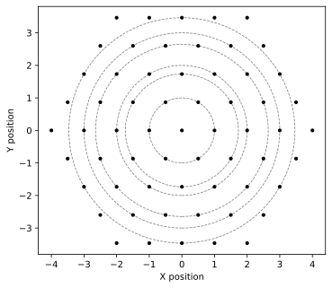

# Angle Calculation Process

When two single layers of a 2D material are stacked with a small misalignment, they produce a moiré pattern with a length scale much larger than the periodicity of either individual layer. At specific twist angles, this results in a ***commensurate moiré pattern***—a structure where atoms from one layer align exactly with those of the other.

In this section, we describe how **MoirePy** calculates the ***commensurate rotation angles*** between two lattices confined to a bounded region. The goal is to identify angles where the lattices align periodically, producing well-ordered moiré patterns that are physically observable.

## 1. Problem Statement

Let lattices $A$ and $B$ be two periodic point sets in two dimensions, each defined by their respective lattice vectors.

We address the following geometric question:

**Given** a rotation angle $\theta$, **does there exist** a point $\mathbf{p} \in A$ and a point $\mathbf{q} \in B$ such that

$$
\mathbf{p} = R(\theta)\mathbf{q}
\tag{1.1}
$$

where $R(\theta)$ denotes the standard rotation matrix. In 2D, this matrix is defined as:

$$
R(\theta) =
\begin{bmatrix}
\cos\theta & -\sin\theta \\
\sin\theta & \cos\theta
\end{bmatrix}
\tag{1.2}
$$

To bound the computation, we restrict our analysis to a finite region by considering only lattice points within a circular region of radius $r$. Let the truncated sets be $A_r = A \cap \text{circle}(r)$ and $B_r = B \cap \text{circle}(r)$.

Our goal is to determine the set of angles $\theta$ (including the corresponding points) for which there exists a pair of points $\mathbf{p} \in A_r$ and $\mathbf{q} \in B_r$ satisfying Equation 1.1.

These angles correspond to commensurate alignments between the two lattices, yielding physically observable moiré patterns.

## 2. Traditional Diophantine Equation Approach

In commensurate moiré superlattices, specific periodic points exist where atoms from the top and bottom layers align exactly. To analyze these alignments, let $(\vec{a}, \vec{b})$ and $(\vec{m}, \vec{n})$ denote the primitive lattice vectors of the lower and upper layers, respectively. The atomic positions in each layer are given by:

$$
\vec{R}^1_{p,q} = a\vec{a} + b\vec{b} \quad \text{and} \quad
\vec{R}^2_{m,n} = R(\theta)(m\vec{m} + n\vec{n}), \quad a, b, m, n \in \mathbb{Z}
$$

*
<strong>Fig 1:</strong> Illustration of vector matching for commensurate moiré patterns. Here vectors m and n are already rotated by angle theta. 
*

For a commensurate moiré superlattice to form, there must exist integers $a, b, m, n$ such that:

$$\vec{R}^1_{p,q} = \vec{R}^2_{m,n}$$

This leads to a condition based on vector magnitudes and orientations:

$$
\vec{a} \cdot \vec{b} = \vec{m} \cdot \vec{n} = \cos{\beta} = \frac{m^2 + n^2 - a^2 - b^2}{2(ab - mn)}
\tag{2.1}
$$

We need to find all integer quadruples (a, b, m, n) satisfying Equation 2.1. Then, the corresponding twist angle $\theta$ can then be computed.

The computation proceeds as follows. The length of the moiré lattice vector $\vec{r}$ connecting equivalent lattice points is:

$$
r = |\vec{r}| = \sqrt{a^2 + b^2 + 2ab\cos\beta}
$$

Using the Law of Sines, we calculate the intermediate angles $\alpha$ and $\gamma$:

$$
\frac{b}{\sin\alpha} = \frac{r}{\sin(180^\circ - \beta)} \quad \Rightarrow \quad
\alpha = \sin^{-1}\left(\frac{b \sin\beta}{r}\right)
\tag{2.2}
$$

$$
\frac{n}{\sin\gamma} = \frac{r}{\sin(180^\circ - \beta)} \quad \Rightarrow \quad
\gamma = \sin^{-1}\left(\frac{n \sin\beta}{r}\right)
\tag{2.3}
$$

The twist angle $\theta$ between the two layers is then:

$$
\theta = \alpha - \gamma = \sin^{-1}\left(\frac{b \sin\beta}{r}\right) - \sin^{-1}\left(\frac{n \sin\beta}{r}\right)
$$

This classical Diophantine approach provides a rigorous framework for determining commensurate twist angles where the lattice vectors form periodic overlaps.

### Time Complexity

The general approach involves iterating over all possible values of the first three variables ($a$, $b$, $m$) and computing the fourth variable ($n$) based on the condition in Equation 2.1. A valid solution exists when $n$ is an integer.

This brute-force search results in a time complexity of $O(n^3)$, where $n$ represents the maximum value of the variables (starting from 0). For large $n$ (i.e., when considering dense lattice points), this cubic complexity becomes computationally prohibitive. We wanted to find a better solution.

## Observations About Lattice Structure

When examining regularly spaced lattices (like triangular or square lattices), we observed several useful structural properties. As shown in Fig. 2, lattice points naturally organize into concentric circles around the origin. If we sort all points by their distance from the origin, we see distinct discrete levels forming - similar to a step function. Each level (corresponding to a specific radius) contains symmetrically arranged points. For instance, in triangular lattices, each level contains a multiple of 6 points due to the lattice's 6-fold rotational symmetry (Fig. 3). (Similarly we see in Square lattice, a multiple of 4 points per level.)

  <figure style="margin: 0; text-align: center;">
    
    <figcaption style="margin-top: 8px; font-style: italic;"><strong>Fig 2:</strong> Lattice points reside in concentric circles</figcaption>
  </figure>

  <figure style="margin: 0; text-align: center;">
    
    <figcaption style="margin-top: 8px; font-style: italic;"><strong>Fig 3:</strong> Number of points in each shell is a multiple of 6 (Triangle lattice)</figcaption>
  </figure>

This symmetric distribution has an important consequence: when two lattices share the same radial level, we only need to align one pair of points at that level. The remaining 5 symmetric points will automatically align due to the lattice symmetry, significantly reducing the computational effort needed to find commensurate angles.

## Our Method

Our approach leverages lattice geometry and symmetry rather than algebraic equations to identify commensurate rotation angles. The method operates directly on the spatial distribution of lattice points, and hence is applicable for any regular lattice structure even stacking two different ones.

### Algorithm Overview

Let $A_r$ and $B_r$ be the sets of lattice points (from lattice A and B respectively) within radius $r$ from the origin.

1. **Group points by radius**:
    For each point ($\mathbf{p}$) in $A_r$ and $B_r$, compute its distance $d = \|\mathbf{p}\|$ from the origin.
    In each lattice, group points that lie at the same radius into *levels*.

2. **Identify shared levels**:
    Let $D = \{d \mid d \text{ occurs in both } A_r \text{ and } B_r \} \setminus \{0\}$.
    These are the radii at which both lattices have points.

3. **Filter by angular sector**:
    For each $d \in D$, consider only those points $\{\mathbf{p}\} \in A_r$ and $\{\mathbf{q}\} \in B_r$ on level $d$ such that

    $$
    0 < \angle\mathbf{p} \le \theta_\text{max}, \quad
    0 < \angle\mathbf{q} \le \theta_\text{max}
    $$

    where $\theta_\text{max}$ is the lattice's symmetry sector (e.g., $60^\circ$ for triangular lattices, $90^\circ$ for square lattices). Although till now we have discussed as if the upper lattice and lower lattice can be different, in practice we have never tested this code on different lattices. Neither do we know if those cases will yield any commensurate angles. For now, we will assume that both lattices are the same. So here when we say lattice's symmetry sector, we mean the symmetry sectors of both are same.

4. **Compute angle differences**:
   Now we will pair points from $\{\mathbf{p}\}$ with $\{\mathbf{q}\}$ at each common level $D$. For each point from $\{\mathbf{p}\}$, we will pair it with every point from $\{\mathbf{q}\}$. For each pair, compute the angle differences. 

This procedure ensures we collect unique, minimal-angle configurations that could align under rotation, constrained to the symmetry of the lattice.

  
Some Practical Optimizations

    <ul>
        <li>
          In <strong>Step 4</strong> after calculating the angle difference (say \(\theta\)), we keep the angle only if it is in the range \(0 < \theta < \theta_\text{max}\). Note that we exclude \(0\) because it corresponds to the trivial case where no rotation is applied, and we exclude \(\theta_\text{max}\) because it corresponds to the case where the two lattices are again perfectly aligned, as if no rotation is applied. Also we do not take angles more than \(\theta_\text{max}\) because they are equivalent to angles less than \(\theta_\text{max}\) due to periodicity.
        </li>
        <li>
          In <strong>Step 1</strong>, when using same lattice as both upper and lower layer, after grouping points that lie at the same distance from the origin, we discard those \(d\)s who just have 6 points (4 points for square lattice). This is because it will lead us to no rotation anyway. We keep only those \(d\)s which have more than 6 points (12, 18, etc. for triangular lattice; 8, 12, etc. for square lattice) where we can form pairs of points that yield non-trivial angles.
        </li>
    </ul>
    

 

### Time Complexity

If the number points is of the order $O(n^2)$ and they are sorted by distance, the time complexity of this part becomes $O(n^2 \log n^2)$. Apart from this all other steps are multiple order smaller than this cost, hence can be ignored. That makes this algorithm much less than the $O(n^3)$ of the Diophantine approach and arguably more intuitive.

### Calculating the lattice vectors given the overlapping points

## Summary

We avoided solving Diophantine equations by leaning on geometry and symmetry:

- Points are grouped by radius
- Only overlapping radii are considered
- Pairwise angle differences yield the commensurate angles

This makes **MoirePy**’s angle detection both **fast and visual**, and opens up room for further optimizations or generalizations.
