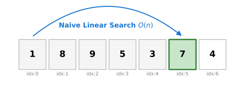
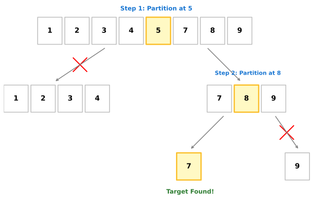
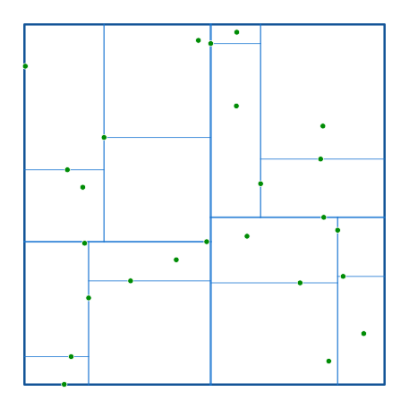

# Searching Algorithm & KDTree

In this section we would learn one of the algorithmic optimisations of MoirePy which makes it so fast. The construction of moiré systems involves repeated geometric queries over large sets of atomic positions. A naive implementation quickly becomes computationally prohibitive. The purpose of this section is to motivate the need for efficient search structures, beginning from first principles.

## Why Do We Need a Search Algorithm?

The fundamental object in MoirePy is a collection of atomic positions embedded in two-dimensional space. These positions are typically represented as a finite set:

$$\{x_i \in \mathbb{R}^2 \mid i = 1, 2, \dots, n\}$$

While constructing Hamiltonians, particularly for interlayer coupling, one frequently encounters the following problem:

Given a point $x$, find all points $x_j$ such that

$$|x - x_j| < r$$

for some fixed radius $r$.
This is not an occasional operation. It is performed repeatedly, often for every atom in one layer against atoms in another layer. Consequently, the efficiency of this search directly determines the overall performance of the simulation.

A human observer can look at a spatial distribution of points and immediately discard large regions as irrelevant. A computer, however, does not "see" geometry in this way. It only processes structured data, typically as arrays or lists of coordinates. Without additional structure, the only available strategy is to examine each point individually.

Thus, the problem reduces to designing a method that allows efficient identification of nearby points without exhaustively checking every element in the dataset.

## The Naive Approach: Linear Search

The most direct method is to iterate over all points $x_j$ and compute the distance to $x$. This results in the algorithm:

For each query point $x$:

* For each $x_j$:
    * Compute $|x - x_j|$
    * Accept if less than $r$, otherwise reject

This procedure requires $O(n)$ time for a single query.

If such a search is performed for every point in the dataset, the total complexity becomes

$$O(n^2)$$

In the context of moiré systems, where $n$ can be large due to superlattice effects, this quadratic scaling is unacceptable. Even moderate increases in system size lead to dramatic increases in computation time.

The inefficiency arises from the absence of any structure in the data. Every query is treated independently, and no information from previous computations is reused.

## A Simpler Analogy: The 1D Search Problem

To understand the core issue, consider finding a specific value in an unsorted 1D array of $n$ elements.

In the above figure, say the task is to find the element `7`. Without order, we must scan the array sequentially layer by layer. We check `1`, then `8`, and later find `7`. In the average case scenario, this requires $O(n)$ time for a single lookup. Doing this search once is fine. However, if we need to search for $n$ different items, the total computational cost mirrors our spatial search problem: it balloons to an unfeasible $O(n^2)$.

The root of this quadratic inefficiency is the lack of organization in the data.

## Sorted Data and Binary Search

Now suppose that the array is somehow already sorted in ascending order. This additional structure enables a fundamentally different search strategy.

Instead of scanning sequentially, one can repeatedly divide the search interval into halves. At each step, the middle element is compared with the target value $x$, and one half of the array is instantly discarded.

As illustrated in the preceding figure, finding an element like 7 in a sorted array drastically minimizes comparisons. For example here we reached 7 in just 3 comparisons. This procedure is known as binary search and has a time complexity of

$$O(\log n)$$

Thus, by introducing structure (sorting), the cost of a single search is reduced from $O(n)$ to $O(\log n)$. If we perform $n$ such searches, the total cost becomes

$$O(n \log n)$$

which is significantly better than $O(n^2)$.

## Total Cost Analysis and When Preprocessing Pays Off

The dramatic improvement in search time assumes the array is already sorted. However, sorting the array requires an initial computational effort of

$$O(n \log n)$$

> Is this upfront trade-off worth it?

Let's compare the total cost for performing $n$ searches over $n$ elements:

* **Naive approach:** $O(n^2)$
* **Sorted approach:** $O(n \log n \text{ (sorting)}) + O(n \log n \text{ (searching)}) = O(n \log n)$

The structured approach is asymptotically and practically far more efficient. The key principle is that sorting is a one-time preprocessing step, whereas searching is performed repeatedly.

In moiré simulations, neighbor searches are performed for entirely large sets of atoms. The total number of queries we make far exceeds the minimum required to justify the preprocessing cost. Therefore, investing the upfront time to organize the spatial data into a searchable structure is absolutely essential.

## Extension to Higher Dimensions

The improvement achieved in one dimension relies on sorting. This idea does not generalize naturally to higher dimensions. In two dimensions, there is no single ordering of points that preserves spatial proximity in a simple way. A sorted list in the $x$-coordinate alone does not guarantee closeness in $y$, and vice versa.

Thus, the notion of ordering must be replaced by a notion of **spatial partitioning**.

The goal remains the same. Given a point $x \in \mathbb{R}^2$, we wish to efficiently identify all points within a radius $r$. However, instead of organizing points along a line, we now organize them within regions of space. The central idea is to recursively divide space into smaller subregions so that large portions can be excluded from consideration during a query.

This leads naturally to tree-based data structures designed for geometric data.

## KD-Tree: Conceptual Overview

A k-dimensional tree, or KD-tree, is a binary tree that partitions space recursively along coordinate axes. Each node in the tree represents a subset of points and is associated with a splitting hyperplane.

In two dimensions, the construction proceeds as follows:

* At the root, points are divided using a vertical line based on their $x$-coordinate.
* At the next level, each subset is divided using a horizontal line based on their $y$-coordinate.
* This process alternates between axes at successive levels.

Each split divides the set of points into two subsets. The recursion continues until a stopping condition is reached, typically when the number of points in a node becomes small.

The resulting structure, visually captured in the above figure, is a binary tree where each node corresponds to a region of space. Leaf nodes contain a small number of points.

This hierarchical partitioning allows efficient queries. When searching for neighbors, entire regions can be excluded if they lie outside the query radius.

A more detailed treatment of KD-trees can be found in the original reference:
[https://en.wikipedia.org/wiki/K-d_tree](https://en.wikipedia.org/wiki/K-d_tree)

## KD-Tree Operations and Complexity

The construction of a KD-tree requires recursively selecting splitting points and partitioning the dataset. With appropriate strategies, this can be achieved in $O(n \log n)$ time.

Query operations, such as nearest-neighbor search or radius search, proceed by traversing the tree. At each node, the algorithm determines whether the corresponding region could contain points within the query radius. If not, that entire subtree is discarded.

The efficiency arises from this pruning step. Instead of examining all points, the algorithm only visits nodes whose regions intersect the search region.

For typical distributions of points, the average query complexity is

$$O(\log n)$$

Thus, in practical applications involving spatial data, KD-trees perform significantly better than naive search.

## Implementation in MoirePy

MoirePy operates in two physical dimensions, so it builds a 2D KD-tree once and queries it repeatedly throughout the simulation. Since our atomic layers are static after generation, we don't need to mathematically add or remove points dynamically. This makes an **immutable KD-tree** the perfect fit, effectively avoiding the cost of maintaining structure during queries.

To achieve maximum performance, MoirePy leverages the [`kiddo`](https://docs.rs/kiddo/latest/kiddo/) library in Rust. `kiddo` is specifically highly-engineered for blazing-fast, static KD-trees.

A key feature of `kiddo` is its **bucket size** parameter. Normally, a tree stores just one point per absolute leaf, which requires jumping around in memory (pointer chasing) as you traverse all the way down. `kiddo` solves this by grouping multiple points into local "buckets" at the leaf nodes.

MoirePy uses a bucket size of **32**. This strikes an optimal computational balance:
* The overall tree depth remains shallow, minimizing branch traversal overhead.
* Once the search algorithm reaches a leaf bucket, the CPU can sequentially and efficiently scan all 32 points, which fits perfectly into modern CPU cache lines without needing expensive memory jumps.

## Summary

The need for efficient search arises from repeated geometric queries over large datasets. A naive approach leads to quadratic complexity, which is not feasible for realistic systems.

By introducing structure, first through sorting in one dimension and then through spatial partitioning in higher dimensions, the cost of search can be reduced significantly.

The KD-tree provides a practical solution for organizing spatial data. It enables efficient queries by hierarchically partitioning space and pruning irrelevant regions.

In MoirePy, this approach is implemented using a high-performance immutable KD-tree with a carefully chosen bucket size. The result is a substantial improvement in computational efficiency, making large-scale moiré simulations tractable.

